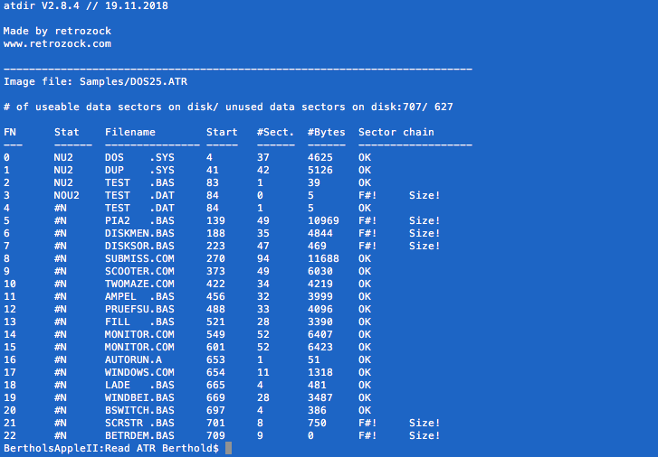
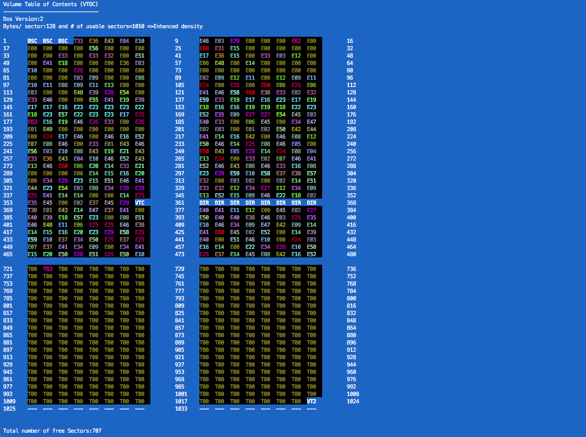

Read ATR
=================
RetroZock 2014
www.retrozock.com
retrozock@hotmail.com

A collection of C- Language tools for processing '*.ATR' image files. 

atdir
-----
Reads the directory of an Atari DOS 2.x formated disk and writes it to the standard output.
Deleted files are also displayed. All files are checked (sector chain, file size, file number).
'atdir' accepts single '*.ATR' image files as input or a file list for batch processing.
'atdump' accepts it's output as input.

atdump
------
Dumps file contents of a file in an '*.ATR' image file to standard output.

atsvtoc
-------
Reads the VTOC (Volume Table of Contents) from an '*.ATR' image file and writes it to the standard output.

Version
=======
Execute binary without command line options, version and usage will be displplaye. You can also check the individual source code file.

License
=======
This work is licensed under a Creative Commons Attribution-NonCommercial-ShareAlike 4.0 International License:
https://creativecommons.org/licenses/by-nc-sa/4.0/
 	

Binary's (and how to build them....)
====================================
You will find the latest binary of all the tools in:
    [Executable files for Mac OS](0_bin/x86/Mac)
     

ONLY THE MAC OS BINARY'S ARE MAINTAINED AND YOU CAN BE SHURE THAT THOSE REPRESENT THE COMPILER RESULT WITH LATEST SOURCE CODE. 
ALL OTHER BINARY'S ARE NOT! (E.G. Atari TOS, MS- DOS...).

    Build the binary's on your Mac for your Mac:
    --------------------------------------------   
    Use the 'build_readATR.sh' script to compile the binary's. The executables and the manuals will be written to
    the 'Mac- Os' 'bin'- folder'.

    Build the binary's for other platforms:
    ---------------------------------------
    Use your favourite compiler. 
    
    I have sucessfully build binary's for the Atari ST on my Mac with Vincent Riviere's binary's of the
    'm68k-atari-mint cross-tools' (see: vincent.riviere.fr).
    
Screenshots
-----------

